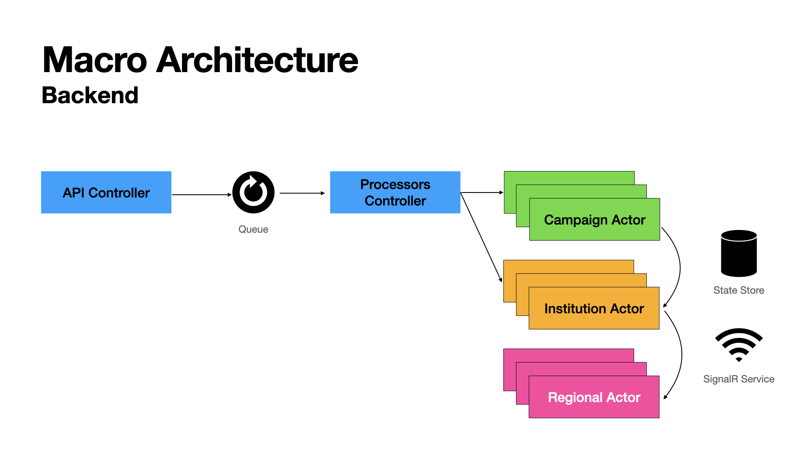
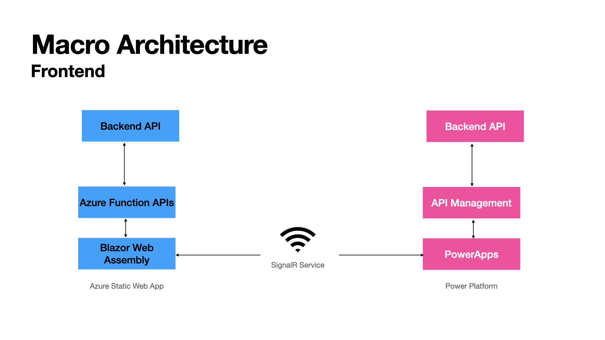
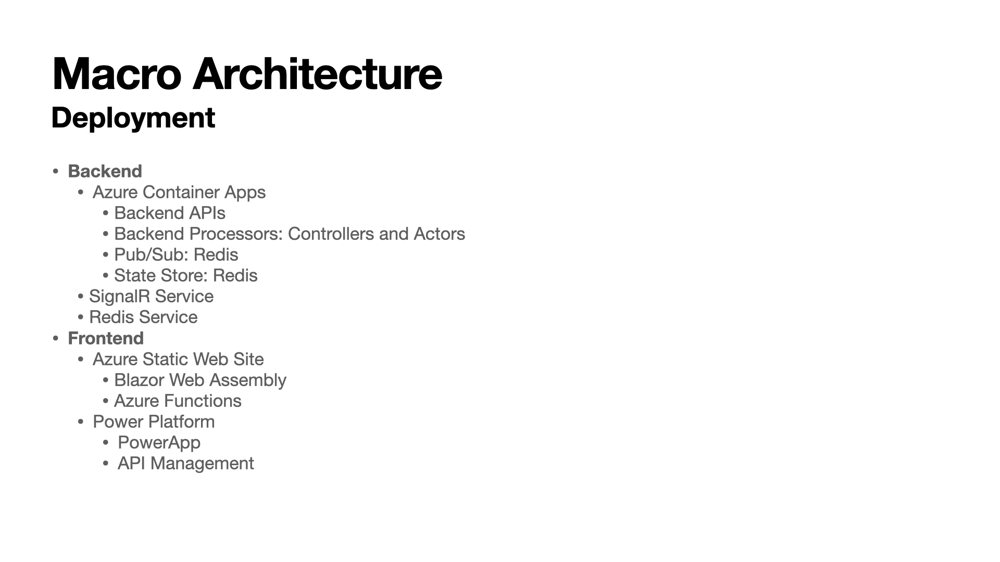

Pledge manager is ....

## Source Code

TBA

## Macro Architecture

### Backend



### Frontend



### Deployment Options



## Microservices

The following are proposed microservices:
- Frontend (hosted in Azure Static Web Apps):
    - Blazor Web Assesmbly (SPA)
    - AZ Functions as APIs to handle/circumvent CORS
- Backend (hosted in Azure Container Apps):
    - Backend API (ACA App1) 
    - 3 Pub/Sub: Campaigns, Commands, Pledges (Redis)
    - Processors (ACA App2)
    - Campaign Actors (ACA App2)
    - 1 Pub/Sub: Externalizations (Redis)
    - Externalization State Update Processor (ACA App3)
    - Externalization gRPC Processor (ACA App3)
    - Externalization Redis Streams Processor (ACA App3)

## Azure Services

- SignalR: Real-time updates to Blazor App clients
- Redis: State Store and Pub/Sub
- Azure Container Apps: hosts all backend containers
- Azure Static Web Apps: hosts the front-end application

## Run Locally

### Pre-requisites

- [Docker](https://docs.docker.com/get-docker/)
- [DAPR](https://docs.dapr.io/getting-started/)
- [SWA CLI](https://github.com/Azure/static-web-apps-cli) (Static Web Apps)

### Redis

*Using a terminal session, access Redis Docker CLI*

```
docker exec -it dapr_redis redis-cli
```

*Clean Redis* 

```
FLUSHALL
```

*Make sure they are all flushed*

```
KEYS *
```

*To get a key value*

```
HGET statestore||CAMP-00001 data
```

### Backend

*Using a terminal session, start the backend campaigns*

```
cd src/backend/campaigns
bash ./start-selfhosted.sh
```

*Using a terminal session, start the backend users*

```
cd src/backend/users
bash ./start-selfhosted.sh
```

*Using a terminal session, start the simulator to seed the database*

```
cd src/backend/simulator
bash ./start-selfhosted-create-only.sh
bash ./start-selfhosted-simulate-donors.sh
bash ./start-selfhosted-simulate-pledges-one-campaign.sh
```

*Using Postman, issue different commands as needed*

Use the [Postman collection](./src/backend/postman/pledge-manager-collection.json):
- Create an institution
- Create an associated campaign (for now please use CAMP-00001 as the identifier :-))
- Submit several pledge for several donors 

### Frontend

*Using a terminal session, start the frontend API*

```
cd src/frontend/api
- dotnet run
```

*Using a browser, access the frontend in a browser*
[https://localhost:5000](https://localhost:5000)

## Test Scenarios

**This assumes that seeding the database is seeded as above**

- Test pledges against `CAMP-00001` which is configured for auto approval mode.
- Test pledges against `CAMP-00002` which is configured for manual approval.
- Test pledges against `CAMP-00003` which is configured for hybrid.
- Test pledges against `CAMP-00004` which is configured for hybrid.
- Test restricted amounts.
- Test min/max amounts.
- Test anonymous auto approval.
- Test match.
- Test pledge approval.
- Test pledge rejection.
- Test auto-deactivation.
- Test campaign update inlcuding behavior.


